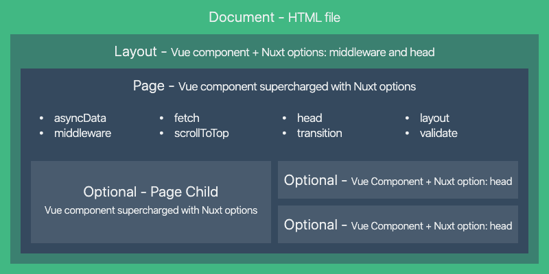
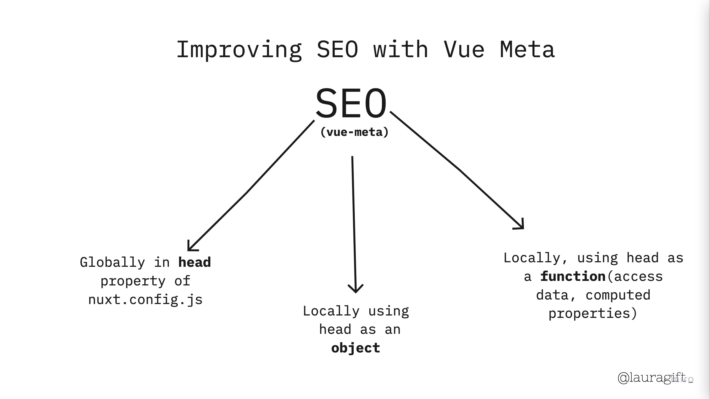
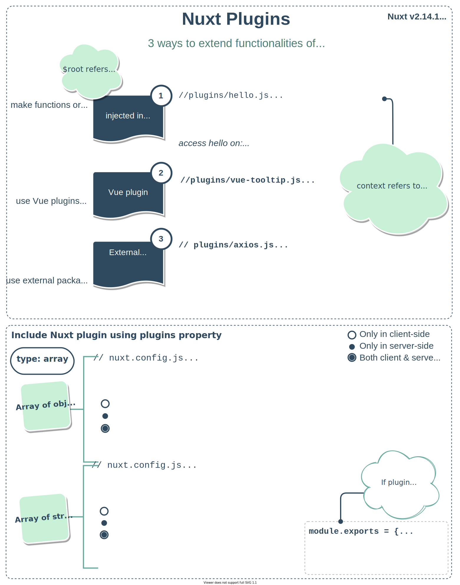
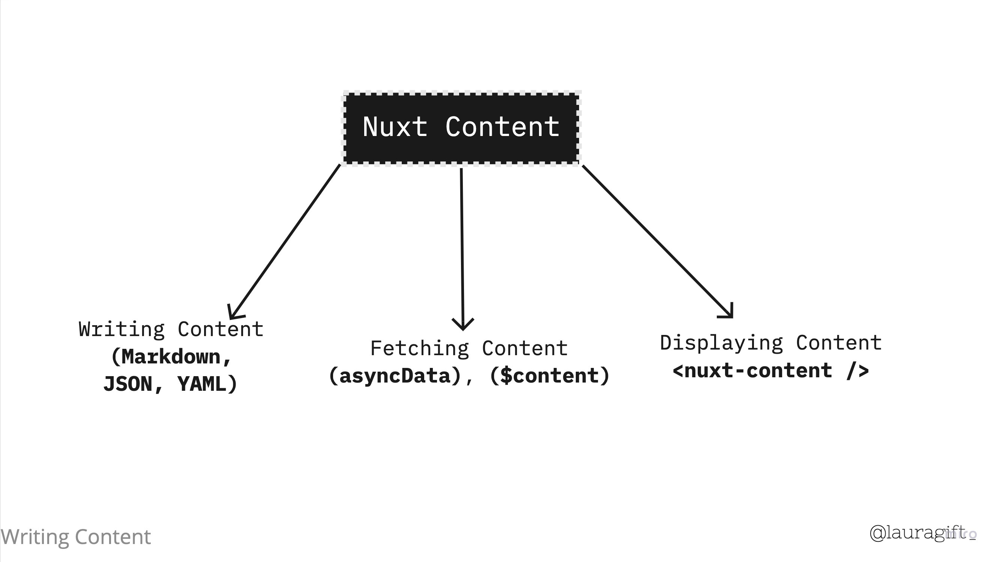

<h1 align="center">
Building From Scratch with Nuxt Workshop
</h1>

<p align="center">This workshop is for anyone with knowledge of JavaScript and Vue.js interested in building web applications with Nuxt.js</p>

Instructor: <a href="https://giftegwuenu.com">Gift Egwuenu</a>

[Workshop Slides](https://miro.com/app/board/o9J_kki51ks=/)

## Sections
- [Introduction](#Introduction)
- [Setup and Installation](#setup-and-installation)
- [What is Nuxt.js and what does it offers](#what-is-nuxt.js-and-what-does-it-offers)
- [A Look at the Nuxt Directory Structure](#a-look-at-the-nuxt-directory-structure)
- [Configuring Nuxt with Nuxt.config.js](#configuring-nuxt-with-nuxt-config-js)
- [The Concept of Layout and Pages](#the-concept-of-layout-and-pages)
- [File System Routing with Nuxt](#file-system-routing-with-nuxt)
- [Fetching Data in Nuxt](#fetching-data-in-nuxt)
- [SEO in Nuxt with vue-meta](#seo-in-nuxt-with-vue-meta)
- [Nuxt Plugins](#nuxt-plugins)
- [Managing State with Vuex Store](#managing-state-with-vuex-store)
- [Extending the App with Nuxt Modules](#extending-the-app-with-nuxt-modules)
- [Deployment Strategies](#deployment-strategies)
- [Deploying the App to Netlify](#deploying-the-app-to-netlify)


## Introduction
[Nuxt.js](https://nuxtjs.org/) is a Vue framework for creating modern web applications that makes development painless and powerful with great developer experience.

In this workshop, we'll cover everything you need to know to build a web application from scratch with Nuxtjs. Some things we'll cover include setting up a nuxt app and extending it's functionality with Nuxt Modules and finally, we'll look at some deployment strategies.

## Setup and Installation
We need to have [Node](https://nodejs.org/) installed on our computer before we begin the workshop.

Download Node for windows [here](https://nodejs.org/en/download/)

Download Node for Mac using [Homebrew](https://brew.sh/).

If we don't have that installed use this command to install it

```bash
/bin/bash -c "$(curl -fsSL https://raw.githubusercontent.com/Homebrew/install/master/install.sh)"

```
and then install node:

```bash
brew install node
```

### Install Nuxt with Create Nuxt App

```bash
npx create-nuxt-app <project-name>
```

We already have a repo setup so go ahead and clone this repo using the following commands:

```
git clone https://github.com/lauragift21/nuxt-workshop.git
```

```
cd nuxt-workshop && yarn
```

> This repo is setup to use [TailwindCSS](https://tailwindcss.com/) for **styling**.

### Exercise 1 (Installation and Setup)

Setup a Nuxt project using the guide detailed above and make sure to have the project running on your computer.

## What is Nuxt.js and what does it offers?

[Nuxt.js](https://nuxtjs.org/) is an open-source Vue framework for building modern web applications that makes development painless and powerful with a great developer experience.

Some of these features are what make Nuxt performant and a good choice for your app:

* Automatic Code Splitting
* Server-Side Rendered, Static-Site Generated / Jamstack, SPA
* Powerful routing system with asynchronous data
* Extend with modular architecture
* Hot Module Replacement in Development
* Write Vue Files **(*.vue)**
* ES6 Transpilation
* Powerful Lighthouse scores out of the box!
* Pre-processing - SCSS, SASS, LESS.

## A Look at Nuxt Directory Structure

The default Nuxt application structure is made up of different files and directories in itself which can be used in building small or large scale applications. The way the directory is setup can always be modified to fit our project needs.

This is a structure tree of a Nuxt directory: 

```bash
.
├── assets
│   └── README.md
├── components
│   ├── AppNav.vue
│   ├── Logo.vue
│   └── README.md
├── layouts
│   ├── default.vue
│   └── README.md
├── middleware
│   └── README.md
├── pages
│   ├── index.vue
│   └── README.md
├── plugins
│   └── README.md
├── static
│   ├── favicon.ico
│   └── README.md
├── store
│   └── README.md
├── .gitignore
├── nuxt.config.js
├── package.json
└── README.md
```

## Configuring Nuxt with `nuxt.config.js`

The configuration for Nuxt application is great and it already covers most use-cases, but Nuxt allows us extend the configuration by specifying the config properties in the `nuxt.config.js` file.

Nuxt let's us customise **webpack configuration**,  define **CSS libraries** to use globally, create **environment variables**, define **meta data** for our application and so much more can be done in the config file.

The [docs](https://nuxtjs.org/guides/configuration-glossary/configuration-build) have a listing of all properties for customization in `nuxt.config.js` file.

## The Concept of Layout and Pages

### Layouts

Layouts are a great help when we want to change the look and feel of your Nuxt.js app. Whether we want to include a sidebar or have distinct layouts for mobile and desktop.

In Nuxt, we can setup a **default Layout** that is used throughout an application, and also create custom layout when we decide to use a different layout on a page.

We manage all the layouts within the `layouts` directory and Nuxt ships with a `default.vue` layout that is used by all pages unless a layout is specified for that page.

```html
<template>
  <Nuxt />
</template>
```

The **Nuxt component** added to a layout renders a Page component.


### Pages

Pages in Nuxt contain an application views and routes. Nuxt will translate all `.vue` files inside the pages directory into a page an automatically create a router configuration for it.

Nuxt add special attributes and functions to a Page to make development of our universal app as eaasy as possible. 

```js
<template>
  <h1 class="red">Hello {{ name }}!</h1>
</template>

<script>
  export default {
    // page properties go here
    head () {

    },
    loading: true,
    layout: 'Home'
  }
</script>

<style>
  .red {
    color: red;
  }
</style>

```

### Views

Views in Nuxt compose of App template, a Layout and an actual Page. In addition, we can define custom meta tags for the head section of each page which are important for SEO (Search Engine Optimization) and setup other custom options in a Page.



### Exercise 2 (The Concept of Layouts and Pages)

Create an About Page within the **Pages Directory** and populate it with a short description about yourself or your bio.

Here's an example:


## File System Routing with Nuxt

Nuxt.js automatically generates the **vue-router** configuration based on our file tree of Vue files inside the pages directory.

Nuxt Routing can be achieved in several ways:

#### Automatic Routes

Automatic routes are created when a new page is added in the `Pages` directory.

Let's say we have a Pages directory structure tree like so:

```bash
.pages
├── profile
│   └── index.vue
├── index.vue
└── README.md
```
The router configuration file will look like this:

```js
router: {
  routes: [
    {
      name: 'index',
      path: '/',
      component: 'pages/index.vue'
    },
    {
      name: 'profile',
      path: '/profile',
      component: 'pages/profile/index.vue'
    },
  ]
}

```

#### Dynamic Routes

We can define a **dynamic route** with a parameter, we need to define a `.vue` file OR a directory prefixed by an underscore.

A tree structured like this: 

```bash
.pages
├── _profile
│   └── index.vue
├── index.vue
└── README.md
```
will generate this: 

```js
router: {
  routes: [
    {
      name: 'index',
      path: '/',
      component: 'pages/index.vue'
    },
    {
      name: 'profile',
      path: '/:profile',
      component: 'pages/profile/index.vue'
    },
  ]
}

```

#### Nested Routes 
Nuxt.js lets us create nested route by using the children routes of vue-router.

To define the parent component of a nested route, we need to create a Vue file with the same name as the directory which contain our children views.

And include `<nuxt-child/>` inside the parent component:


```bash
.pages
├── profile
│   └── index.vue
├── profile.vue
└── README.md
```
will generate this: 

```js
router: {
  routes: [
    {
      path: '/profile',
      component: 'pages/profile.vue',
      children: [
        {
          name: 'profile',
          path: '',
          component: 'pages/profile/index.vue'
        }
      ]
    },
  ]
}
```

#### Navigation with Nuxt Link Component

The nuxt-link component is provided out of the box with nuxt and is used to link between pages. Instead of using `a` we will replace that with `nuxt-link` and instead of `href="/"`, NuxtLink uses `to="/"`.

## Fetching Data in Nuxt


## SEO in Nuxt with Vue-Meta

In Nuxt applications, we can significantly improve SEO of the pages by adding correct meta tags to respective pages. Nuxt uses Vue Meta under the hood to update the document head and meta attributes of our application.

We can add meta information in three different ways in Nuxt.js:



* Globally using the `head` property in nuxt.config.js

```js
export default {
  head: {
    title: 'Nuxt Workshop',
    meta: [
      { charset: 'utf-8' },
      { name: 'viewport', content: 'width=device-width, initial-scale=1' },
      {
        hid: 'description',
        name: 'description',
        content: 'This is the Nuxt Workshop Site'
      }
    ],
    link: [{ rel: 'icon', type: 'image/x-icon', href: '/favicon.ico' }]
  }
}
```

* Locally using the `head` as an object

```js
<script>
export default {
  head: {
    title: 'About',
    meta: [
      {
        hid: 'description',
        name: 'description',
        content: 'This is the about page'
      }
    ],
  }
}
</script>
```
* Locally using the `head` as a function so that we have access to data and computed properties.


```js
<script>
export default {
  data () {
    return {
      title: 'About'
    }
  },
  head() {
    return {
      title: this.title,
      meta: [
        {
          hid: 'description',
          name: 'description',
          content: 'This is the about page'
        }
      ],
    }
  }
}
</script>
```

### Exercise 4 (SEO in Nuxt with Vue Meta)

Setup the required Meta Tags for your application on two levels:

- Global Level (nuxt.config.js)
- Local Level (About Component)

## Nuxt Plugins
Nuxt.js Plugins allows us to define **Javascript Plugins** that we can run before instantiating the root Vue.js Application.

We'll need to create plugins in some of these use-cases:



#### Need to use Vue Plugins

Every time we need to use `Vue.use()`, we should create a file in `plugins/` and add its path to `plugins` property in `nuxt.config.js`.

In a case where we need to use a library like Vue Tooltip, we need to configure a Plugin before using it in the application.

In `plugins/vue-tooltip.js` add the following:

```js
import Vue from 'vue'
import VTooltip from 'v-tooltip'

Vue.use(VTooltip)

```

In `nuxt.config.js` add: 

```js
plugins: [
  '@/plugins/vue-tooltip.js'
]
```

#### Add External Packages like `axios`

We may want to use external packages/modules in our application.

Like in `Axios` we can create a axios.js plugin for adding custom configurations.

```js
export default function ({ $axios, redirect }) {
  $axios.onError(error => {
    if (error.response.status === 404) {
      redirect('/404')
    }
  })
}
```

#### Inject variable in \$root or context

When there's a need to make functions or values available across the app. We can inject those variables into **Vue instances (client side)**, the **context (server side)** and even in the Vuex store. It is a convention to prefix those functions with a $.

## Managing state with Vuex Store

## Extending the app with Nuxt Modules

Modules are Nuxt.js extensions which can extend its core functionality and add endless integrations.

[A list of curated Modules from the Nuxt Community](https://github.com/nuxt-community/awesome-nuxt#modules)

In our app, we're already using a TailwindCSS Module as a `buildmodule` - that are only imported during build time or in development mode.

```js
export default {
  buildModules: [
    '@nuxtjs/tailwindcss'
  ],
  modules: [
    '@nuxt/content'
  ]
}
```

## Nuxt Content Module

Nuxt Content Module acts as a Git-based Headless CMS and let's you write in a content/ directory and fetch your Markdown, JSON, YAML, XML and CSV files through a MongoDB like API.

### Setup

```bash

yarn add @nuxt/content

```
Inside `nuxt.config.js` file:

```js
export default {
  modules: [
    '@nuxt/content'
  ]
}
```

Nuxt content follows a **three step process** from writing out content to fetching and displaying the content in the application.



### Writing Content

With Nuxt Content we need to create a `content/` directory in the root of the project where it is used.  Nuxt can parse  .md, .yaml, .json, .csv, .xml files.

With the content directory with the following files:

```bash
content/
  articles/
    first-article.md
    second-article.md
  home.md
```

Will generate the following properties:

```bash
dir
path
slug
extension (ex: .md)
createdAt
updatedAt
```

### Fetching Content

Nuxt Content injects a `$content` instance that can be accessed anywhere using `this.$content` and plugins, nuxtServerInit, asyncData can access it from `$context.content` 

```js
<script>
export default {
  async asyncData({ $content }) {
    const article = await $content("articles").fetch();
    return {
      article
    }
  }
};
</script>

```
#### Content API

This module exposes an API endpoint in development so you can easily see the JSON of each directory or file, it is available on `http://localhost:3000/_content/`.

### Displaying Content

You can use the `<nuxt-content />` component to display content from the markdown body.

```html

<template>
  <section>
    <h1>{{ article.title }}</h1>
    <nuxt-content :document="article" />
  </section>
</template>

```

#### Live Editing 

In development mode, you can edit your content by double-clicking on the <nuxt-content> component. A textarea will allow you to edit the content of the current file and will save it on the file-system.


## Deployment Strategies

## Additional Resources 
[Nuxt Documentation](https://nuxtjs.org/guides)  
[Nuxt Content](https://content.nuxtjs.org)  
[Tailwind CSS](https://tailwindcss.com)
[Tutorial on Nuxt Content](https://nuxtjs.org/blog/creating-blog-with-nuxt-content)

## License

[](http://creativecommons.org/licenses/by-nc-sa/4.0/)

This work is licensed under a [Creative Commons Attribution-NonCommercial-ShareAlike 4.0 International License](http://creativecommons.org/licenses/by-nc-sa/4.0/)